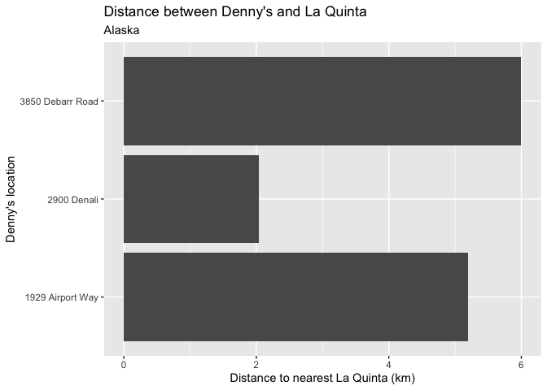
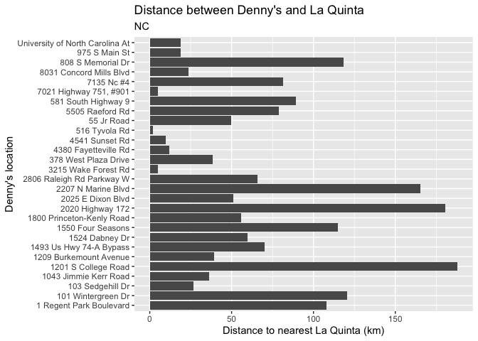
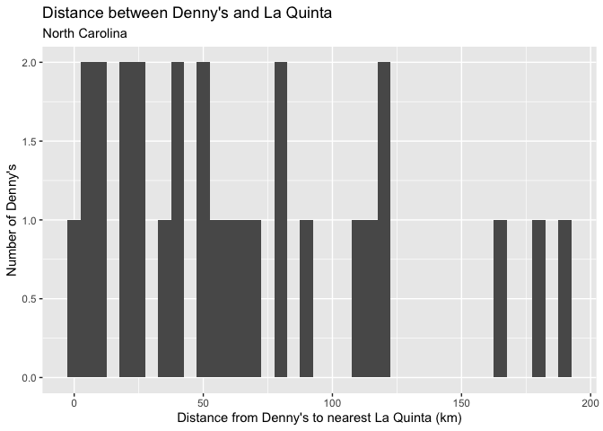
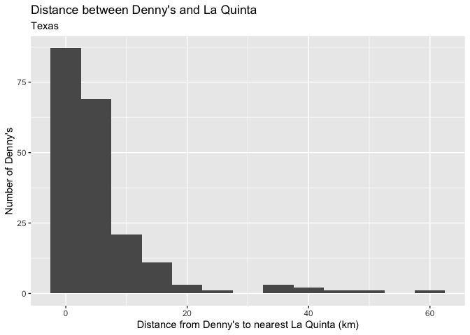
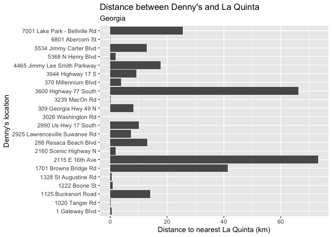
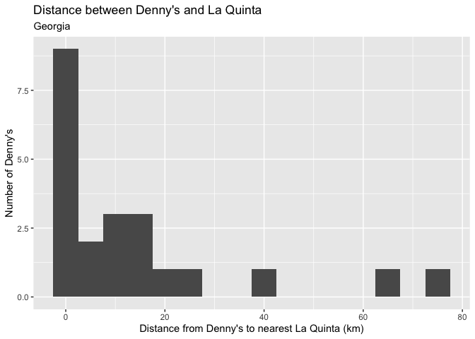

Lab 04 - La Quinta is Spanish for next to Denny’s, Pt. 2
================
Marcus Minko
02-08-2022

### Load packages and data

``` r
library(tidyverse) 
library(dsbox) 
```

``` r
states <- read_csv("data/states.csv")
dn <- dennys
lq <- laquinta
```

### Exercise 1

``` r
dn_ak <- dn %>%
  filter(state == "AK")
nrow(dn_ak)
```

    ## [1] 3

### Exercise 2

``` r
lq_ak <- lq %>%
  filter(state == "AK")
nrow(lq_ak)
```

    ## [1] 2

### Exercise 2

``` r
dn_lq_ak <- full_join(dn_ak, lq_ak, by = "state")
dn_lq_ak
```

    ## # A tibble: 6 × 11
    ##   address.x     city.x state zip.x longitude.x latitude.x address.y city.y zip.y
    ##   <chr>         <chr>  <chr> <chr>       <dbl>      <dbl> <chr>     <chr>  <chr>
    ## 1 2900 Denali   Ancho… AK    99503       -150.       61.2 3501 Min… "\nAn… 99503
    ## 2 2900 Denali   Ancho… AK    99503       -150.       61.2 4920 Dal… "\nFa… 99709
    ## 3 3850 Debarr … Ancho… AK    99508       -150.       61.2 3501 Min… "\nAn… 99503
    ## 4 3850 Debarr … Ancho… AK    99508       -150.       61.2 4920 Dal… "\nFa… 99709
    ## 5 1929 Airport… Fairb… AK    99701       -148.       64.8 3501 Min… "\nAn… 99503
    ## 6 1929 Airport… Fairb… AK    99701       -148.       64.8 4920 Dal… "\nFa… 99709
    ## # … with 2 more variables: longitude.y <dbl>, latitude.y <dbl>

#There are 6 observations and 11 variables (address.x, city.x, state,
zip.x, longitude.x, latitude.x, address.y, city.y, zip.y, langitude.y,
latitude.y)

### Exercise 3

``` r
haversine <- function(long1, lat1, long2, lat2, round = 3) {
  # convert to radians
  long1 = long1 * pi / 180
  lat1  = lat1  * pi / 180
  long2 = long2 * pi / 180
  lat2  = lat2  * pi / 180
  
  R = 6371 # Earth mean radius in km
  
  a = sin((lat2 - lat1)/2)^2 + cos(lat1) * cos(lat2) * sin((long2 - long1)/2)^2
  d = R * 2 * asin(sqrt(a))
  
  return( round(d,round) ) # distance in km
}
```

…

### Exercise 4

``` r
dn_lq_ak <- dn_lq_ak %>% 
    mutate(distance = haversine(longitude.x, latitude.x, longitude.y, latitude.y))
```

…

### Exercise 5

``` r
dn_lq_ak_mindist <- dn_lq_ak %>%
  group_by(address.x) %>%
  summarize(closest = min(distance))

dn_lq_ak_mindist %>% 
     summarize(closest)
```

    ## # A tibble: 3 × 1
    ##   closest
    ##     <dbl>
    ## 1    5.20
    ## 2    2.04
    ## 3    6.00

``` r
dn_lq_ak_mindist %>% 
     summarize(mean(closest))
```

    ## # A tibble: 1 × 1
    ##   `mean(closest)`
    ##             <dbl>
    ## 1            4.41

### Exercise 6

``` r
dn_lq_ak_mindist %>% 
            ggplot(mapping = aes(x = closest, 
                                 y = address.x)) +
            geom_col() + 
            labs(
              title = "Distance between Denny's and La Quinta", subtitle = "Alaska", 
              x = "Distance to nearest La Quinta (km)", 
              y = "Denny's location")
```

<!-- --> …

### Exercise 6

``` r
#filter NC dennys
dn_nc <- dn %>%
  filter(state == "NC")

#filter NC laquinta
lq_nc <- lq %>%
  filter(state == "NC")

# Join data
dn_lq_nc <- full_join(dn_nc, lq_nc, by = "state")
dn_lq_nc
```

    ## # A tibble: 336 × 11
    ##    address.x    city.x state zip.x longitude.x latitude.x address.y city.y zip.y
    ##    <chr>        <chr>  <chr> <chr>       <dbl>      <dbl> <chr>     <chr>  <chr>
    ##  1 1 Regent Pa… Ashev… NC    28806       -82.6       35.6 165 Hwy … "\nBo… 28607
    ##  2 1 Regent Pa… Ashev… NC    28806       -82.6       35.6 3127 Slo… "\nCh… 28208
    ##  3 1 Regent Pa… Ashev… NC    28806       -82.6       35.6 4900 Sou… "\nCh… 28217
    ##  4 1 Regent Pa… Ashev… NC    28806       -82.6       35.6 4414 Dur… "\nDu… 27707
    ##  5 1 Regent Pa… Ashev… NC    28806       -82.6       35.6 1910 Wes… "\nDu… 27713
    ##  6 1 Regent Pa… Ashev… NC    28806       -82.6       35.6 1201 Lan… "\nGr… 27407
    ##  7 1 Regent Pa… Ashev… NC    28806       -82.6       35.6 1607 Fai… "\nCo… 28613
    ##  8 1 Regent Pa… Ashev… NC    28806       -82.6       35.6 191 Cres… "\nCa… 27518
    ##  9 1 Regent Pa… Ashev… NC    28806       -82.6       35.6 2211 Sum… "\nRa… 27612
    ## 10 1 Regent Pa… Ashev… NC    28806       -82.6       35.6 1001 Aer… "\nMo… 27560
    ## # … with 326 more rows, and 2 more variables: longitude.y <dbl>,
    ## #   latitude.y <dbl>

``` r
# Mutate distance var
dn_lq_nc <- dn_lq_nc %>% 
    mutate(distance = haversine(longitude.x, latitude.x, longitude.y, latitude.y))

# Min distance
dn_lq_nc_mindist <- dn_lq_nc %>%
  group_by(address.x) %>%
  summarize(closest = min(distance))

dn_lq_nc_mindist %>% 
     summarize(closest)
```

    ## # A tibble: 28 × 1
    ##    closest
    ##      <dbl>
    ##  1   108. 
    ##  2   120. 
    ##  3    26.7
    ##  4    36.1
    ##  5   188. 
    ##  6    39.1
    ##  7    70.1
    ##  8    59.5
    ##  9   115. 
    ## 10    55.9
    ## # … with 18 more rows

``` r
dn_lq_nc_mindist %>% 
     summarize(mean(closest))
```

    ## # A tibble: 1 × 1
    ##   `mean(closest)`
    ##             <dbl>
    ## 1            65.4

``` r
# Visualization

dn_lq_nc_mindist %>% 
            ggplot(mapping = aes(x = closest, 
                                 y = address.x)) +
            geom_col() + 
            labs(
              title = "Distance between Denny's and La Quinta", subtitle = "NC", 
              x = "Distance to nearest La Quinta (km)", 
              y = "Denny's location")
```

<!-- -->

``` r
dn_lq_nc_mindist %>% 
               ggplot(mapping = aes(x = closest)) +
               geom_histogram(binwidth = 5) + 
            labs(
              title = "Distance between Denny's and La Quinta", subtitle = "North Carolina", 
              x = "Distance from Denny's to nearest La Quinta (km)", 
              y = "Number of Denny's")
```

<!-- --> …

### Exercise 7

``` r
#filter TX dennys
dn_tx <- dn %>%
  filter(state == "TX")

#filter TX laquinta
lq_tx <- lq %>%
  filter(state == "TX")

# Join data
dn_lq_tx <- full_join(dn_tx, lq_tx, by = "state")
dn_lq_tx
```

    ## # A tibble: 47,400 × 11
    ##    address.x    city.x state zip.x longitude.x latitude.x address.y city.y zip.y
    ##    <chr>        <chr>  <chr> <chr>       <dbl>      <dbl> <chr>     <chr>  <chr>
    ##  1 120 East I-… Abile… TX    79601       -99.6       32.4 3018 Cat… "\nAb… 79606
    ##  2 120 East I-… Abile… TX    79601       -99.6       32.4 3501 Wes… "\nAb… 79601
    ##  3 120 East I-… Abile… TX    79601       -99.6       32.4 14925 La… "\nAd… 75254
    ##  4 120 East I-… Abile… TX    79601       -99.6       32.4 909 East… "\nAl… 78516
    ##  5 120 East I-… Abile… TX    79601       -99.6       32.4 2400 Eas… "\nAl… 78332
    ##  6 120 East I-… Abile… TX    79601       -99.6       32.4 1220 Nor… "\nAl… 75013
    ##  7 120 East I-… Abile… TX    79601       -99.6       32.4 1165 Hwy… "\nAl… 76009
    ##  8 120 East I-… Abile… TX    79601       -99.6       32.4 880 Sout… "\nAl… 77511
    ##  9 120 East I-… Abile… TX    79601       -99.6       32.4 1708 Int… "\nAm… 79103
    ## 10 120 East I-… Abile… TX    79601       -99.6       32.4 9305 Eas… "\nAm… 79118
    ## # … with 47,390 more rows, and 2 more variables: longitude.y <dbl>,
    ## #   latitude.y <dbl>

``` r
# Mutate distance var
dn_lq_tx <- dn_lq_tx %>% 
    mutate(distance = haversine(longitude.x, latitude.x, longitude.y, latitude.y))

# Min distance
dn_lq_tx_mindist <- dn_lq_tx %>%
  group_by(address.x) %>%
  summarize(closest = min(distance))

dn_lq_tx_mindist %>% 
     summarize(mean(closest))
```

    ## # A tibble: 1 × 1
    ##   `mean(closest)`
    ##             <dbl>
    ## 1            5.79

``` r
# Visualization

dn_lq_tx_mindist %>% 
               ggplot(mapping = aes(x = closest)) +
               geom_histogram(binwidth = 5) + 
            labs(
              title = "Distance between Denny's and La Quinta", subtitle = "Texas", 
              x = "Distance from Denny's to nearest La Quinta (km)", 
              y = "Number of Denny's")
```

<!-- --> ### Exercise 6

``` r
#filter GA dennys
dn_ga <- dn %>%
  filter(state == "GA")

#filter GA laquinta
lq_ga <- lq %>%
  filter(state == "GA")

# Join data
dn_lq_ga <- full_join(dn_ga, lq_ga, by = "state")
dn_lq_ga
```

    ## # A tibble: 902 × 11
    ##    address.x    city.x state zip.x longitude.x latitude.x address.y city.y zip.y
    ##    <chr>        <chr>  <chr> <chr>       <dbl>      <dbl> <chr>     <chr>  <chr>
    ##  1 3026 Washin… Augus… GA    30907       -82.0       33.5 184 Nort… "\nAc… 30102
    ##  2 3026 Washin… Augus… GA    30907       -82.0       33.5 1200 Vir… "\nAt… 30344
    ##  3 3026 Washin… Augus… GA    30907       -82.0       33.5 4820 Mas… "\nAt… 30337
    ##  4 3026 Washin… Augus… GA    30907       -82.0       33.5 1350 Nor… "\nAl… 30022
    ##  5 3026 Washin… Augus… GA    30907       -82.0       33.5 1184 Dog… "\nCo… 30012
    ##  6 3026 Washin… Augus… GA    30907       -82.0       33.5 1000 Lin… "\nDo… 30134
    ##  7 3026 Washin… Augus… GA    30907       -82.0       33.5 2370 Ste… "\nDu… 30096
    ##  8 3026 Washin… Augus… GA    30907       -82.0       33.5 2535 Cha… "\nAt… 30324
    ##  9 3026 Washin… Augus… GA    30907       -82.0       33.5 2415 Pac… "\nAt… 30339
    ## 10 3026 Washin… Augus… GA    30907       -82.0       33.5 6260 Pea… "\nAt… 30328
    ## # … with 892 more rows, and 2 more variables: longitude.y <dbl>,
    ## #   latitude.y <dbl>

``` r
# Mutate distance var
dn_lq_ga <- dn_lq_ga %>% 
    mutate(distance = haversine(longitude.x, latitude.x, longitude.y, latitude.y))

# Min distance
dn_lq_ga_mindist <- dn_lq_ga %>%
  group_by(address.x) %>%
  summarize(closest = min(distance))

dn_lq_ga_mindist %>% 
     summarize(mean(closest))
```

    ## # A tibble: 1 × 1
    ##   `mean(closest)`
    ##             <dbl>
    ## 1            14.0

``` r
# Visualization

dn_lq_ga_mindist %>% 
            ggplot(mapping = aes(x = closest, 
                                 y = address.x)) +
            geom_col() + 
            labs(
              title = "Distance between Denny's and La Quinta", subtitle = "Georgia", 
              x = "Distance to nearest La Quinta (km)", 
              y = "Denny's location")
```

<!-- -->

``` r
dn_lq_ga_mindist %>% 
               ggplot(mapping = aes(x = closest)) +
               geom_histogram(binwidth = 5) + 
            labs(
              title = "Distance between Denny's and La Quinta", subtitle = "Georgia", 
              x = "Distance from Denny's to nearest La Quinta (km)", 
              y = "Number of Denny's")
```

<!-- -->

``` r
dn_lq_ak_mindist %>% 
    summarize(mean(closest))
```

    ## # A tibble: 1 × 1
    ##   `mean(closest)`
    ##             <dbl>
    ## 1            4.41

``` r
dn_lq_nc_mindist %>% 
    summarize(mean(closest))
```

    ## # A tibble: 1 × 1
    ##   `mean(closest)`
    ##             <dbl>
    ## 1            65.4

``` r
dn_lq_tx_mindist %>% 
    summarize(mean(closest))
```

    ## # A tibble: 1 × 1
    ##   `mean(closest)`
    ##             <dbl>
    ## 1            5.79

``` r
dn_lq_ga_mindist %>% 
    summarize(mean(closest))
```

    ## # A tibble: 1 × 1
    ##   `mean(closest)`
    ##             <dbl>
    ## 1            14.0

Hedberg’s observation is probably most true for TX. Even though AK has a
lower mean distance, there are so few observations that it probably
shouldn’t be considered.
